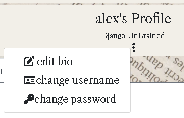

# /slant README

## Table of Contents

1. [Introduction](#introduction)
2. [Links](#links)
3. [User Experience (UX)](#user-experience-ux)
4. [User Stories & Methodology](#user-stories)
5. [Design](#design)
6. [Features](#features)
7. [Security](#security)
8. [Bugs & Issues](#bugs—issues)
9. [Future Features](#future-features)
10. [Testing](#testing)
11. [Deployment](#deployment)
12. [Technologies Used](#technologies-used)
13. [Credits and Acknowledgements](#credit--acknowledgements)

## Introduction

*NB - This repository is the frontend React application for Portfolio Project 5 of Code Institute's full stack development course. Please see the link section below for navigation to the front end application and project board.*

Modern current affair news media is a minefield. There are so many sources and articles competing for your attention, pulling you this way and that, ensuring that most people will end up in their own ‘bubble’ – a place where they only consume stories that are algorithmically tailored to them.

slant does things differently.

slant is a totally objective repository of journalistic articles where users can submit and share pieces – either written independently or from one of the major outlets – and comment or bookmark their favourites.

However, this is not all – each submission to slant is rated by our users and an average rating is displayed beneath each article. Users are encouraged to rate articles on critical analysis and not sensationalism, because most of all, slant is a place for stories without the "noise" of modern news outlets - no ads, no distractions, just discussion and analysis. 

slant aims to break the news media wheel of doom and expand the horizons of it’s users, and provide a website where the bias of a story is voted on by the users of the website – allowing each and every user to examine journalistic prejudices and begin to examine the media from a Critical stance, with each piece of content receiving ratings based on user inputs.

slant created mainly using **React** and **Django REST framework**, and is my PP5 submission for Code Institute Advanced Front End.

## Links

- [Deployed Site](https://slant-react-38faa77003fe.herokuapp.com/)
- [Backend](https://github.com/AlbaXIII/slant-api/)
- [Deployed Backend](https://slantapi-c636400a6ffd.herokuapp.com/)
- [Project Kanban Boar](https://github.com/users/AlbaXIII/projects/11)

## User Experience (UX)

### Strategy 

slant is a journalistic archive containing independent and legacy media articles that can be access by subscribed users. Logged in users can then browse the library of pieces, filter by sector & title keyword, like, share and favourite at their leisure, and most importantly vote on bias – the score of which is displayed at the tope of each article. 

### Site Goals

* To provide **all site users & visitors** a database of submitted news and current affairs articles that any user of the site can examine for free.
* To provide **all site users & visitors** the ability to filter and sort the articles by user-designated criteria, for example subject and keyword.
* To provide **site members** the functionality to comment, favourite and rank articles based on a  back-end defined scale.
* To provide **site members** the ability to create a profile and choose a user ‘flair’. Users can then access a profile page with their saved & submitted articles.

### Ideal User

The ideal user of slant is a user who is willing to analyse the news they are digesting through their usual methods, and users who are willing to expand their knowledge of media literacy through more intense scrutiny on the fourth and fifth estates.

## User Stories & Methodology 

### Agile Working

The working schedule of this project was outlined by a single project [Kanban board](https://github.com/users/AlbaXIII/projects/11), sorted by project category and purpose. Furthermore, the user stories are also subcategorised with MoSCoW prioritisation -  incrementally increasing the effectiveness of time management on this project.

### EPICs

In order to further organise what could easily be an overly daunting project, I added an EPIC grouping system to the granular user stories. This system created a hierarchy and broke the project down into workable pieces, creating an effective development flow whilst working towards the overarching goal of project completion. 

**critical-eye-drf**

database setup
article model
comment model
review model
profile model
deployment

admin documentation

**critical-eye-react**

initial setup
navigation & user validation 
adding & submitting articles
articles page
article detail 
profile page
final deployment

admin documentation

### User Stories

User stories for this project are based on a custom template below, separated into project categories and linked to up completion benchmarks from which the user story can be completed.

“Using **slant**;

 A **visitor/user/admin** can **ability** in order to **result**”

### Completion benchmarks

CB1 - 

CB2 - 

CB3 - 

The total list of user stories noted in the Kanban board are listed below, organised into their respective EPIC & MoSCoW categories.

**slant-api**

database setup

* Link project to kanban board
* Initialise Django REST apps, link database & cloudinary storage
* Create SuperUser for Admin access
* Deploy to Heroku

article model

* add article model and migrate
 
comment model

* add comment model and migrate

review model

* add review model and migrate

profile model

* add profile model and migrate

final deployment

* finalise thorough testing of all models
* complete final deployment to Heroku

admin documentation

* complete initial README documentation

**slant**

initial setup

* create React app – M
* initial deployment to Heroku – M

navigation & user validation 

* add navbar component to all pages – M
* add page routing system for non-refreshing navigation – M
* create signup form to add new user accounts – M
* create operational log in & log out forms – M
* add navbar conditional account status for visual indicator of account login condition – S

adding & submitting articles

* create and submit articles with subject & publisher tagging – M
* from main article page, users can access a more detailed view for more information, including engagement metrics for example comments and rating – M
* members can add likes to articles – S
* members can add dislikes to articles – C
* members can add to article rating system – S
* once submitted, authenticated site members can edit their own articles – M
* once submitted, authenticated site members can delete their own articles – M

articles page

* users can filter articles by subject matter and submitted publisher – M
* users can use search bar to search for articles based on keywords – S
* site members can further filter articles based on publisher – S
* article list to have infinite scroll feature for seamless navigation with no pagination – M

article detail 

* all users can view comments and rating system on detailed article page – M
* site members can add comments using built-in comment form on detail view – M
* site members can sort comments by submission date – S
* once submitted, site members can edit their created comments – M
* once submitted, site members can delete their created comments – M
* site members can access rating system and add their own opinion using intuitive CTA – M

profile page

* site members can access a profile page with a custom profile image – M
* profile page will display number of submitted articles & favourited/rated posts – M
* profile page will show list of favourited/submitted articles navigable by tab delineation – S
* users can access profile page of other users to view their post history – C

final deployment

* thorough testing implemented on all site features – M
* final deployment to Heroku – M

admin documentation

* finalise README – M

### Site Visitor Goals

- As a site visitor I would like to understand the purpose of the website when accessing the home page.
- As a site visitor I would like to be able to always be cognizant of site navigation status through clear labelling and navigation components.
- As a site visitor I would like to be able to browse posted articles, and sort by subject and publisher.
- As a site visitor I would like to understand the account registration process and recognise it is mandatory to post my own content.
- As a site visitor I would like to be able to easily create an account through clear site navigation.

###  Site Member Goals

- As a site member I can access the login/logout functionality on all pages.

- As a site member I would like to be able to see authentication status on all pages.

- As a site member I would like to be able to submit my own articles from all pages using the built-in submission form once logged in.

- As a site member I would like to be able to edit or delete my submitted articles.

- As a site member I would like to able to like, add comments, and submit bias rating to other articles. 

- As a site member I would like to be able to view a profile page with my submitted and favourited pages.

### Administrator Goals

- As a site administrator I can use full CRUD operations on all articles on the database.

- As a site administrator I can add or delete profiles.

## Design

The main guiding principal behind the creation of slant was one of minimalism without scarcity. I wanted to create a platform where users can gleam the maximum amount of information from a concise heading breakdown without being overwhelmed, and then access a more detailed view with a illustrative picture and the engagement components for authorised users. It wasn't designed with the modernity of a current content site, the idea is for the text & discussion to take center stage.

In terms of colours and layout, I wanted to emulate the look and feel of an vintage newspaper, with a background of a collaged newspaper cutting contrasting with the stark close-to black print providing a striking visual contrast. With the information of each article, there is a splash of colour on each one to keep the UX clean and defined.

### Wireframes

Wireframes created using [Balsamiq Wireframes](https://balsamiq.com/)

### Color Scheme

The color scheme utilised in slant was made using [Color Hex]( https://www.color-hex.com/color-palette/1047882) and is called ‘Old Money’. 

### Fonts

The font for the main logo brand is called 'Special Elite' and is remeniscent of old typewriters to go along with the clasic typeface design philosophy. The main articles are a font called 'Libre Caslon' - a classic font that is clean and readable.

### ERD

The main Entity Relationship Diagram (ERD) for the project was designed using the web service [DrawSQL](https://drawsql.app/).

### CRUD Table

## Features

### NavBar

The NavBar is the first and most vital component in the site, being present on every page. On the left-hand side, the site brand logo is displayed as a link to the homepage, whilst on the right, a collapsible responsive dropdown menu shows links depending on the authentication status of the user in question;

When on smaller screens, the menu shows as a burger icon, with a custom hook that allows users to collapse the menu by clicking anywhere on the screen and not just in on the burger menu.

### Authentication

Using the NavBar, users can access forms that handle all stages of authentication. They can access a signup form;

A login form;

Or a logout form once logged in;

All stages of authentication have defensive programming inputs, so you are not able to enter an invalid password, or an empty input.

### Article Page

The main home page of the site is the landing pad for all users. In this page, each individual Article is rendered with the required amount of information, such as title, publisher, subject, and external link(if applicable).

[slant main article display](src/assets/readme/readme-screenshots/main-article-display.PNG)

At the top of the page, there is a search bar that renders a filtered selection of Articles depending on keyword, user or subject – and can be further filtered down by selecting one of the discreet subject buttons which will return only Articles of that subject.

Each article has a reactive favourite component on the right, where the metrics for favourites and comments are displayed to show the amount of engagement an Article has. The favourite handle effect can be accessed through this page, and an authenticated user will be able to add an Article to their favourites by clicking on the star. Unauthorised users will be shown a tooltip informing them of their unauth status, and a different tooltip will show for users favouriting their own articles.

Lastly in this page, article owners can see a dropdown menu for accessing the editing and deletion of their submitted articles.

### Article Creation

Through the “create” link shown to authorised users at the top of the NavBar, authenticated users can access the Article Creation form. The form renders a text input for title and link, and dropdown inputs for subject and publisher. An Image input is placed at the top of the form, and will render a placeholder image if none is selected by the user.

The text body is a textarea form that has an unlimited character count for the submission of long reads.

### Article Detail

This more detailed view has a larger card structure, with the display of the text body and the image (placeholder or submitted).

In this detail view, Article owners can access the same dropdown form as on the main article page, which either renders the edit form with the current information for easy changing or deletes the article from the database.

Authenticated users can also access the same favouriting function from the main Article page.

### Rating Form & Comments

Beneath each Article in the detailed Article view is the rating and comment forms.

The rating form is 2 form ranges, rendered as a slider numbered from 1 to 10. The upper form returns an average of all rating ids associated with a particular Article, whilst the lower is an interactive form that sends a value to the database that updates the average in real time.

Unauthenticated users are unable to access the interactive form and can only see the average. Furthermore, once submitted, users can update their rating views as they see fit if they change their minds.

Underneath the rating form is the comment form. Comments are delineated by username, and date of submission which updates dynamically. Similarly to ratings, this is locked off from unauthenticated users and will either just show the comments linked to a particular Article or a message depending on the presence of any comments.

Comment owners can access the same model of dropdown as the Article submittors, which allows them to update and edit their comments as they see fit.

### Profile

Once authorised, a user can access the profile page through their username navlink displayed in the NavBar, or view other profiles by accessing the usernames of other posters through their article submissions.

The profile page displays the username and small bio of the user, which a dropdown menu that allows the account owner to edit their username, bio or password.

Chiefly displayed in the profile page is a tabbed display of both the Articles submitted by the user and their favourited Articles, which can be swapped between at their leisure.

All functionality rendered in every Article (favouriting, detail view) are still available in this view as it rendering the same article element as displayed in the home page.

## Security

Each form has defensive programming utilised for empty or invalid inputs.

A redirect hook is also in place to relay users attempting to access out-of-bounds URLS, sending unauthorised users back to the home page if they don’t pass the currentuser context.  

## Bugs & Known Issues

### Development

- Image validation in ArticleEditForm.js

When implementing the ArticleEditForm, I was having an error when attempting to resubmit the edited Article back to the database;

This issue was cause by a conflict in formData resubmission, where I was passing an undefined value but still attempting to append to it by duplicating the formData. The fix was to rework the handling logic to include a conditional append to the formData only if a a new file is actually selected.

- RatingForm.js

The rating form component went through quite a few development cycles. The initial idea was to have the rating displayed as a ‘gauge’ instead of a range input, and I was going to use an external library from [mui](https://mui.com/x/react-charts/gauge/) or the [npm version](https://www.npmjs.com/package/react-gauge-component) but time constraints meant that I had to retire that idea progression and go for a more easily implementable range system.

Once decided, I had to retrofit the slant API in order to receive the average ratings, but in it’s initial implementation I could only send the default integer returned from the initial useState declaration, which was 5.

This was because both my API view and call in both ends of the stack were misaligned and sending and receiving the wrong data in my fetchRating function.

- Deployment

When heading to final deployment, I came into conflict with a very strange deployment error in Heroku. When deploying the main branch, the CommentCreateForm.js component was stopping the deployment as Heroku was flagging it as not found. After troubleshooting this was found to be because the component in GitHub was labelled as commentCreateForm and was therefore bricking imports when run as a buildpack in Heroku.

To solve this, I deleted the comment form, pushed the empty code, reimplemented the form, pushed the code again and checked for correct formatting.

###  Unfixed bugs

No known unfixed bugs at time of deployment.

## Future Features

- Comment Filtering & Favouriting

In a future development cycle a user would be able to filter comments by the number of favourites each comment received, which would allow them to sort by the most engaging content.

- Replies to comments

In a similar vein, replying to comments is another feature to be implemented in a further cycle. This would allow users to create mini-threads and increase UX for conversations between users.

- Comments in profile view

Users could be able to view all of their posted comments collated in a similar vein to favourites and submissions. This could be useful to quickly locate and reveal a memorable interaction with another user.

## Testing

### Validators

**ESLINT**

All custom JavaScript files passed through [eslint](https://eslint.org/) with no issues.

**W3C CSS**

All CSS utilised by slant passes through [Jigsaw W3C CSS validator](https://jigsaw.w3.org/css-validator/validator) with no issues.

### Manual Testing

USER STORIES

| User Story      | Acceptance Criteria | Expected Outcome  | Pass/Fail 
| ----------- | ----------- | ----------- | -----------
| [#2 Deploy Early](https://github.com/AlbaXIII/slant/issues/2) | Deploy early to Heroku | Site deployed | PASS
| [#3 Create NavBar](https://github.com/AlbaXIII/slant/issues/3) | Create Navbar component on all pages | Component created & visible on all pages | PASS
| [#4 Add routing system](https://github.com/AlbaXIII/slant/issues/4) | Create routing system for navigation | System implemented & tested | PASS
| [#5 Signup form](https://github.com/AlbaXIII/slant/issues/5) | Create signup form for new users to register accounts | Form implemented & tested with backend | PASS
| [#6 Login/Logout form](https://github.com/AlbaXIII/slant/issues/6) | Create login/logout form for new users to register accounts | Forms implemented & tested with backend | PASS
| [#7 Create/Submit articles](https://github.com/AlbaXIII/slant/issues/7) | User submit articles | Article form created, submissions to backend tested | PASS
| [#9 Favourite articles](https://github.com/AlbaXIII/slant/issues/9) | User favourite articles | Favourite function created, updates to backend tested | PASS
| [#10 Rate articles](https://github.com/AlbaXIII/slant/issues/10) | User can add rating to articles | Rating function created, updates to backend tested | PASS
| [#11 Edit/delete articles](https://github.com/AlbaXIII/slant/issues/11) | User can edit/delete submitted articles | Edit form/deletion commands created & tested | PASS
| [#16 Submit comments](https://github.com/AlbaXIII/slant/issues/16) | User can submit comments | Comment form added & tested | PASS
| [#18 Edit comments](https://github.com/AlbaXIII/slant/issues/18) | User can edit submitted comments | Edit form command created & tested | PASS
| [#19 Delete comments](https://github.com/AlbaXIII/slant/issues/19) | User can delete submitted comments | Delete command created & tested | PASS
| [#20 Acess profile page](https://github.com/AlbaXIII/slant/issues/20) | User can access profile page with submittted/favourited articles | profile page added & tested | PASS

**NAVBAR**

| **Test**    | **Action** | **Expected Outcome**  | **Pass/Fail** | **Comments** |
| ----------- | ----------- | ----------- | ----------- | ----------- |
| NavBar displays brand icon/home link, signup, and login links for first time user | Logout as an authenticated user and visit site, check all nav items and links are correct | Nav list items display correctly and links function for first time users	 | PASS
| NavBar display differentiates between logged in and logged out users | Log in with account credentials and view navbar items for visual confirmation of user status | Signup/Login NavBar links become Account usernamename and link to logout form, with additional link to create article form | PASS
| NavBar account name functions to take authenticated user through to profile page | Log in as a user and test username navbar link functions as link to profile | Username NavBar link take authenticated users to profile page | PASS
| NavBar create article link functions to take authenticated user through to create article form | Log in as a user and test create navbar link functions as link to create article page | create NavBar link take authenticated users to create article form | PASS
| NavBar brand icon functioning correctly as link to homepage for all users | Test link to homepage as authenticated and unauthenticated user | Link functions correctly to homepage base URL "/" | PASS
| NavBar displays on all pages regardless of user status | Visit all pages as authenticated and unauthenticated user and get visual confirmation NavBar displays consistently across all pages | NavBar showing correctly on all pages | PASS

**ACCOUNT**
| **Test**    | **Action** | **Expected Outcome**  | **Pass/Fail** | **Comments** |
| ----------- | ----------- | ----------- | ----------- | ----------- |
| First time visitor can register for account through signup form in NavBar | Access as first time user, use account register link to make account and log in | Account created successfully, NavBar visually changes to display username | PASS
| Authenticated users can logout through provided NavBar link | As a logged in user, logout using NavBar | Link redirects to logout page, logout successful, NavBar reverts to pre-login  | PASS
| Returning users can login through provided NavBar link | As a returning user, log in through NavBar link | Link redirects to login page, login successful, Navbar updates to show username | PASS
| Returning users can access login page through registration form | As a logged out user, access signup form and use provided link to login page | Link redirects to login page | PASS

**ARTICLE LIST**
| **Test**    | **Action** | **Expected Outcome**  | **Pass/Fail** | **Comments** |
| ----------- | ----------- | ----------- | ----------- | ----------- |
| Main article list displays infinite scroll of articles fetching more data from the backend dynamically for all users | Visit site as a new user and member, access main articl list home page | article list displayed correctly and updates with fetchdata call | PASS
| Loading spinner displays on wait to fetch article list | refresh page to see if spinner activates | spinner visible in loading stage | PASS
| Search bar returns filtered build list based on keyword input | Visit site in all user states, enter/delete keyword into search bar | Site filters article list dynamically with each keypress, reverting on clearing search bar | PASS 
| Button subject filters dynamically filter articles based on selected subject button | visit site in all auth states, press each subject button | main articles page displays filtered article set depending on which button pressed (see comments) | PASS (see [known Bugs & Issues](#bugs--known-issues))
| Auth user can favourite articles in main article view by clicking the star | visit site as auth user, click star | favourite count iterated up, visual feedback provided to user in form of colour change & article added to profile favourite tab | PASS
| Non-auth user cannot favourite articles | visit site as unauth user, click star | favourite function disabled & notifie to user via tooltip | PASS
| All users can access article detail view by title, comment link | visit site as all user states, attempt to access article detail by all link methods | article detail opens on all intended links | PASS
| Article owners can access edit/delete dropdown menu & utilise both commands in article list view | submit article, check for dropdown menu & test edit/delete functions | menu appears to article owners and functions correctly | PASS

**ARTICLE DETAIL**
| **Test**    | **Action** | **Expected Outcome**  | **Pass/Fail** | **Comments** |
| ----------- | ----------- | ----------- | ----------- | ----------- |
| Article detail shows full article information in different format to main Article | access single article id through URL or main page & check for all information displayed | detail view shows image, article body | PASS
| Article owners can access edit/delete dropdown menu & utilise both commands in article list view | submit article, access detail view & check for dropdown menu & test edit/delete functions | menu appears to article owners and functions correctly | PASS
| Auth user can favourite articles in article detail view by clicking the star | visit site as auth user, click star | favourite count iterated up, visual feedback provided to user in form of colour change & article added to profile favourite tab | PASS
| All users can see average rating form in disabled state | access detail page as all user states to check rating section | all users able to view average rating | PASS
| Auth users can add rating using second rating form | second rating form is available and interactable for auth users | auth users able to submit rating, average rating updates dynamically, users can update rating with second input | PASS
| Auth users can leave a comment on any article including owned | Access article detail page as authorised user, owner and leave a comment through comment form | Comment form updates instantly with time of day & profile link | PASS
| Comment owners can access edit/delete dropdown menu & utilise both commands in article list view | submit comment, access detail view & check for dropdown menu & test edit/delete functions | menu appears to article owners and functions correctly | PASS
| Non auth users cannot access comment form | visit detail view as unauth user, attempt to access comment form | form hidden for unauth users | PASS

**ADD/EDIT ARTICLE**
| **Test**    | **Action** | **Expected Outcome**  | **Pass/Fail** | **Comments** |
| ----------- | ----------- | ----------- | ----------- | ----------- |
| Auth users can upload articles using create form or create URL | Complete form fields as a auth user and submit using form | redirection takes user through to new article detail view instantly as visual confirmation | PASS
| Form reacts defensively to required unfilled fields | attempt to send incomplete formdata | form reacts defensively via DOM messaging | PASS
| Optional fields remain optional | image/link fields submit placeholders if left unfilled | default placeholder image & link text uploaded to database if unfilled | PASS
| Edit article form loads previous data on access | submit article, access edit form and check for empty form | form retains data from previous upload | PASS

**PROFILE**
| **Test**    | **Action** | **Expected Outcome**  | **Pass/Fail** | **Comments** |
| ----------- | ----------- | ----------- | ----------- | ----------- |
| Auth users' profile pages displays tabbed display of both submissions and favourites | Create account, submit article, favourite article, check profile page for updates | updated display shows posted/favourited article in list view as like the home page | PASS
| Deleted/unfavourited articles are removed from profile view | submit article, check for reaction in profile page | deleted/unfavourited articles removed | PASS
| Profile owners can change username, bio & password through dropdown form | create account, login & use dropdown to access change forms | all change forms function correctly | PASS

**FOOTER**
| **Test**    | **Action** | **Expected Outcome**  | **Pass/Fail** | **Comments** |
| ----------- | ----------- | ----------- | ----------- | ----------- |
| Footer displays correctly on all pages for both first time users and members | Visit all pages as authenticated and unauthenticated user | Footer displays correctly on all pages | PASS
| Github link functions correctly and opens developer profile page in new tab | Access link on all pages to test link to GitHub is operational and opens in new tab | Link opens new tab and lands on correct page on all pages | PASS

**CRUD TESTS**

| **CREATE** | Add Article through create form, create ratings and comments through article view, create account through signup form.

| **READ** | Article list, Article detail, rating & comment pane all accessible to all users.

| **UPDATE** | Article/comment/rating owners can update their submissions through dropdown on all pages.

| **DELETE** | Article/comment/rating owners can delete their submissions through dropdown on all pages.

## Deployment

Project was created entirely in VSCode.

Git commands were were grouped into the following commit message categories;

- **"feat"** - feature work
- **"maint"** - maintenance work
- **"docs"** - documentation work

All commands passed through the git commit -m command, and pushed to github with git push.

### Forking & Cloning

To fork this repository;

1. On Github, navigate to [the slant repository](https://github.com/AlbaXIII/slant).
2. In the top-right hand corner of the page, click fork.
3. Choose an owner for the forked repository.
4. Optionally, rename, add a description, and/or copy the default branch only.
5. Click create fork.

To clone this repository;

1. On Github, navigate to [the slant repository](https://github.com/AlbaXIII/slant).
2. Above the list of files click <> Code.
3. Copy the URL of the repository - you may choose to clone by HTTPS, using a SSH key, or Githubn CLI.
4. Open Git Bash or other IDE.
5. Navigate to your selected working directory.
6. Type git clone, then post the URL.
7. Press enter. 

### Heroku

1. Log in or register, then click 'create app'.
2. In the new app menu, click on deploy.
3. Connect the project to Github by clicking on the deployment method, selecting Github, and locating the repository.
4. Back in the deploy tab, click deploy branch at the bottom of the page if the correct branch is selected above (main by default).
5. View app when the process is complete.

## Technologies Used

**LANGUAGES**

- HTML5
- CSS
- Javascript inc. NodeJS 16.20.2
- Django REST Framework
- React Bootstrap v4

**EXTERNAL**

- Balsamiq Wireframes
- Font Awesome
- Google Fonts
- Heroku

## Credits and Acknowledgments 

### Credits

- This project, as with the slant API, is heavily based on the skeleton of the ‘moments’ project from Code Institute’s DRF & React advanced front end walkthrough module.
- Style and layout inspiration from [Reddit](https://reddit.com) and [Ground News](https://ground.news).
- Credit as well to many repositories looked to for inspiration, for example;
    - [yakker](https://github.com/lee-joanne/yakker-frontend/) by [lee-joanne](github.com/lee-joanne)
    - [KitRate](https://github.com/TR94/kit-rate-pp5-frontend) by [TR94](https://github.com/TR94/)
    - [Travel Tickr](https://github.com/SandraBergstrom/travel-tickr) by [Sandra Bergstrom](https://github.com/SandraBergstrom/)
- The countless StackOverflow & Reddit posts used during the development process.
- Special credit to the Code Institute Slack & Tutor Support channels.

### Acknowledgements

- To my mentor Dick Vlaanderen, who as always was a great help.
- My friends Alex & Ernie for their wisdom.
- My wife Kate, for her unending patience!